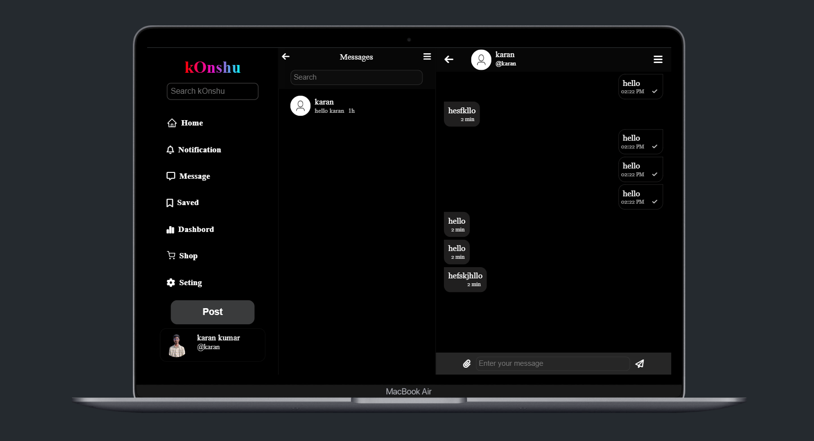

# 👋 Hi, I'm Karan  

## Personal Portfolio Website
This repository contains the source code for the personal portfolio website of Karan Kumar. It showcases his web development projects, skills, and provides ways to connect with him.

## 🚀 About Me  
🌐 Web Developer | 💻 MongoDB & Node.js Enthusiast | ⚡ Passionate about building chat applications  

## 🛠 Tech Stack  
- **Frontend:** HTML, CSS, JavaScript  
- **Backend:** Node.js, Express.js  
- **Database:** MongoDB  
- **Tools:** Git, GitHub, Google Sheets API  

## ✨ Features
- About Me section introducing Karan Kumar.
- Projects showcase: Displays various web development projects with detailed descriptions, technologies used, and links to GitHub repositories or live demos.
- Skills section: Highlights proficiency in frontend (HTML, CSS, JavaScript) and backend (Node.js, MongoDB) technologies.
- Resume Download: Allows users to download Karan's resume.
- Contact Information: Provides a contact form and links to social media profiles (LinkedIn, GitHub, etc.).
- Responsive Design: The website is designed to be accessible and user-friendly across various devices and screen sizes.

## 🚀 Getting Started
To explore the portfolio website:
1.  Simply open the `index.html` file in a modern web browser.
2.  Use the navigation bar at the top to jump to different sections like 'About', 'Projects', 'Skills', and 'Contact'.
3.  In the 'Projects' section, you can click on '..Show more' to see more details about each project.
4.  Links to live demos and GitHub repositories (where available) are provided for each project.
5.  The website is responsive and should adapt to different screen sizes.

## 📸 Screenshots
Here are a few glimpses of the portfolio website:

## 🔗 Connect With Me  
  
  

## 📊 GitHub Stats  
  
  
